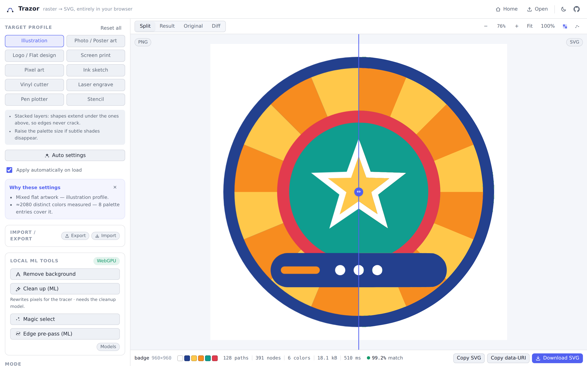

# Trazor

**Raster → SVG, entirely in your browser.** A vectorization studio that turns
PNG/JPEG/WebP/GIF/BMP images into clean, editable, cuttable SVG — with no
server, no upload, no account. Host it on any static host (GitHub Pages
included); your images never leave the machine.



## Why another vectorizer?

Because the tracing algorithm is the product. Trazor implements a
full **Potrace-class curve chain** (from Peter Selinger's 2003 paper — clean-room,
no GPL code) and applies it **per color layer**, not just to black & white:

- **Crack-boundary decomposition** with turn policies, exact pixel geometry.
- **Optimal polygon** via penalty-minimizing dynamic programming — staircase
  noise becomes deliberate straight lines instead of wobble.
- **Least-squares vertex adjustment** — sub-pixel accurate corners.
- **Corner-aware smoothing (α_max)** — circles come out round, squares stay
  sharp, on the same image.
- **Curve-run optimization** — adjacent Béziers merge while staying within
  tolerance, so node counts stay low.

On top of that, three things most tracers don't do:

- **Seam-free cutout mode.** In `cutout` layering the color segmentation's
  boundary network is fitted **once** — every edge shared by two regions is a
  single curve reused by both (with junction points pinned exactly). Adjacent
  shapes are mathematically identical along their shared border: **no hairline
  gaps, no overlaps**, ever. Ideal for cutting machines, screen printing and
  clean editing.
- **Centerline tracing.** For pen plotters and engraving, strokes follow the
  _middle_ of drawn lines (Zhang-Suen skeleton → graph walk → junction
  continuation merging → Schneider Bézier fitting), with automatic stroke-width
  estimation from the ink.
- **Honest fidelity scoring.** Every result is re-rasterized and compared to
  the source with a mean ΔE in Oklab; the score and a difference heatmap are
  right in the UI.

## Features

- **Modes**: Color, Grayscale, Black & White (Otsu / fixed / adaptive
  threshold), Centerline.
- **Layering**: `stacked` (layers extend underneath — crack-proof, great for
  illustration) or `cutout` (exact seam-free partition).
- **Curve modes**: smooth splines, straight polygons, or `pixel` —
  pixel-perfect rectilinear paths that keep sprite art exact.
- **Palettes**: automatic Oklab k-means++ (deterministic), _or pick from
  data-derived suggestions_ — Exact, Balanced, Bold, Rich, Vivid, Muted,
  Duotone, Mono — or edit any palette color in place (spot colors, brand
  colors).
- **Gradient fills** _(beta, opt-in)_: smooth color ramps (skies, soft shading,
  spotlights) are detected and painted with a single SVG
  `<linearGradient>`/`<radialGradient>` instead of posterized bands — mesh-free
  (geometry unchanged, cutout stays seam-free), fewer shapes, no banding.
  Experimental and off by default; enable "Gradient fills" in the palette
  settings.
- **Target profiles** with machine-aware defaults and practical notes:
  Illustration, Photo/Poster, Logo, Screen print, Pixel art, Ink sketch,
  **Vinyl cutter** (layered spot color — one `<g>` sheet per color, mm units),
  **Laser engrave**, **Pen plotter** (centerline, for line art), **Stencil**
  (island detection warns about pieces that would fall out).
- **Local ML tools** (optional, on-device via ONNX Runtime Web, WebGPU with
  WASM fallback): **background removal** (U²-Netp, ~4.6 MB), **magic
  select** — click an object (SlimSAM, ~10 MB) and vectorize just that — a
  learned **edge pre-pass** (the project's own ~0.46 MB model, served
  same-origin) that guides the tracer to keep fine detail on noisy or
  compressed input, and a one-shot **cleanup** model that denoises/de-JPEGs the
  working image before tracing. Models download once and cache in the browser;
  the app is fully functional without them.
- **Auto settings**: instant image-statistics analysis recommends a profile,
  palette size and preprocessing, with human-readable reasons — applied
  automatically as each image loads (toggleable), or on demand. Detects
  grayscale content, keeps saturated two-tone marks in color, and recovers
  clean shapes from compression-degraded flat art (denoise + speckle cleanup).
- **Physical output**: px or **mm units** with real document sizes, precision
  control, **path minification** (relative/H/V commands, collinear cleanup,
  `<rect>`/`<circle>` detection, and circular-arc `A` fitting that collapses
  near-circular Bézier runs to exact arcs), **group-by-color** (one `<g>` layer per color
  so cut/print tools separate sheets automatically), tiny-feature warnings below
  cuttable size.
- **Studio UI**: drag & drop / paste / one-click sample gallery (flat logo,
  photo, pixel art, poster landscape, ink, illustration, a detailed monochrome
  mandala and a degraded-JPEG recovery test), quick **Home** / **Open** nav,
  split & difference views with
  zoom/pan, a **node overlay** (toggle, `N`) that draws every path's anchor
  points, Bézier handles and outlines — color-coded by element kind (traced
  paths vs. `rect`/`circle`/`ellipse` primitives, with a legend) so you can see
  the traced geometry's complexity at a glance, per-stage timings, palette
  swatches, node/path/byte stats, download / copy / data-URI export, dark &
  light themes, keyboard shortcuts.
- **Portable settings**: export the full configuration as versioned JSON to the
  clipboard or a `.json` file, and import it back by paste or file — share a
  recipe or move it between machines. Everything stays local.
- **Localized**: English and French, auto-detected from the browser with a
  header language switcher; the choice is remembered.
- **Deterministic**: same image + same settings ⇒ byte-identical SVG.

## Quick start

```sh
npm install
npm run dev        # Vite dev server
npm run build      # production build → apps/web/dist
npm run preview    # serve the production build
```

Everything is static output — deploy `apps/web/dist` anywhere.

### Deploy to GitHub Pages

The included workflow (`.github/workflows/deploy.yml`) builds with
`BASE_PATH=/<repo>/` and publishes to Pages on every push to `main`
(enable **Settings → Pages → Source: GitHub Actions** once). Any other static
host works too: set `BASE_PATH` to the sub-path you serve from (default `/`).

## Architecture

npm-workspaces monorepo, strict TypeScript, zero runtime dependencies in the
algorithm packages. The pipeline runs in a Web Worker with cooperative
cancellation (latest settings win; stale runs abort between stages).


| Package          | Role                                                                                                                                                                                    |
| ---------------- | --------------------------------------------------------------------------------------------------------------------------------------------------------------------------------------- |
| `@trazor/core`   | Shared types, settings schema + profiles, Oklab color math, geometry, deterministic PRNG                                                                                                |
| `@trazor/raster` | Resize, denoise (median/bilateral), background flattening, k-means++ quantization (exact & fixed palettes), Otsu/adaptive thresholds, morphology, Zhang-Suen thinning, chamfer distance |
| `@trazor/trace`  | The tracer: crack decomposition, Potrace-chain fitting, shared boundary graph (seam-free cutout), centerline extraction, Schneider fitting                                              |
| `@trazor/svg`    | Compact SVG serialization (px/mm, evenodd holes, gap-fill strokes) + output analysis                                                                                                    |
| `@trazor/engine` | Mode pipelines, staging/progress/cancellation, warnings, worker protocol + client                                                                                                       |
| `@trazor/ml`     | Background removal, click-to-segment, learned edge pre-pass, and cleanup, on ONNX Runtime Web + model cache                                                                             |
| `@trazor/assist` | Image statistics → recommended settings & suggested palettes                                                                                                                            |
| `apps/web`       | Vue 3 + Pinia studio UI                                                                                                                                                                 |

**Pipeline**: decode → resize → denoise → flatten alpha → _(color)_ Oklab
k-means++ → region cleanup → _(opt)_ gradient detection → per-layer Potrace chain (stacked) or shared
boundary graph (cutout) → _(bw)_ threshold → despeckle → trace →
_(centerline)_ threshold → thin → graph → fit → serialize → analyze → warn.

Every algorithm's source is cited in [`docs/REFERENCES.md`](docs/REFERENCES.md);
package API contracts live in [`docs/CONTRACTS.md`](docs/CONTRACTS.md).

## Development

```sh
npm test           # vitest — 176 unit tests across all packages
npm run typecheck  # tsc (packages) + vue-tsc (app)
npm run lint       # oxlint
npm run fmt        # oxfmt
npm run check      # all of the above
npm run e2e        # real-browser smoke test (builds required; uses system Chromium)
```

The e2e script drives the built app with Playwright, vectorizes the bundled
samples, saves the SVGs to `e2e-artifacts/` and refreshes `docs/screenshot.png`.

## Notes on licensing

- This repository is **MIT**. The tracing algorithms are implemented from
  their published papers; no GPL code (e.g. the Potrace reference
  implementation) was used or linked.
- ML model weights keep their own licenses (both Apache-2.0): u2netp via the
  rembg mirror, SlimSAM via the Xenova ONNX export. They are downloaded at
  runtime, not distributed with this repository.

## Roadmap

- Plotter niceties: pen-travel path ordering, SVG → HPGL/G-code hints
- Kerf/offset compensation (polygon offsetting) for cutting
- Gradient detection: single-region ramps and elliptical radials (linear, radial and multi-stop ship today)
- Semantic layering with SAM masks (object-per-layer SVG)
- Differentiable refinement pass (WebGPU) against the source image
- More UI languages (English and French ship today)

The ML approach behind several of these — shape/primitive fitting, semantic layering, the differentiable refinement pass —
and how a training dataset would be produced (and how determinism is scoped so WebGPU stays allowed) is written up in
[`docs/ML_STRATEGY.md`](docs/ML_STRATEGY.md).
